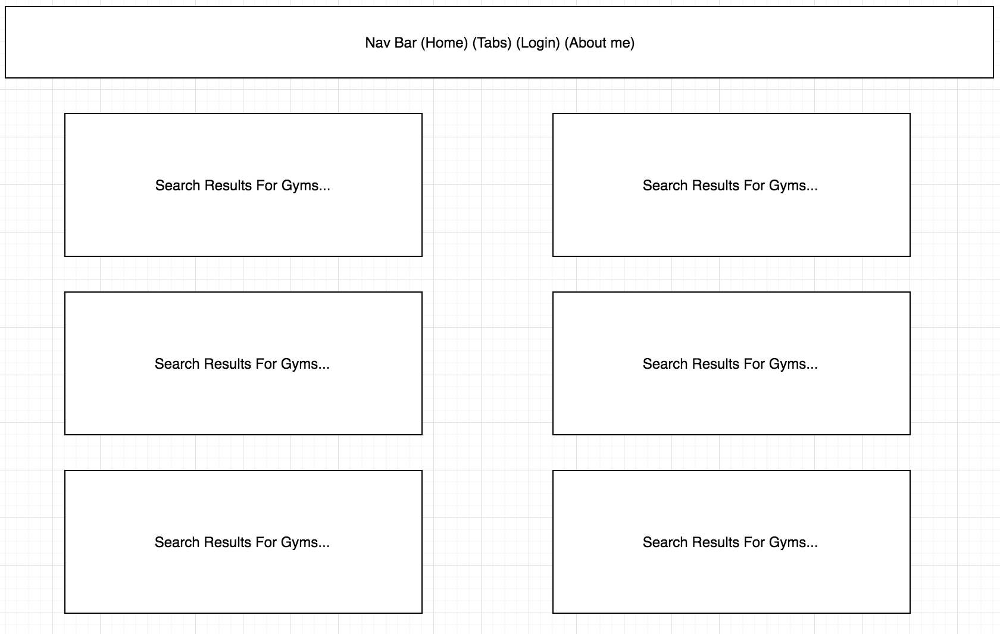
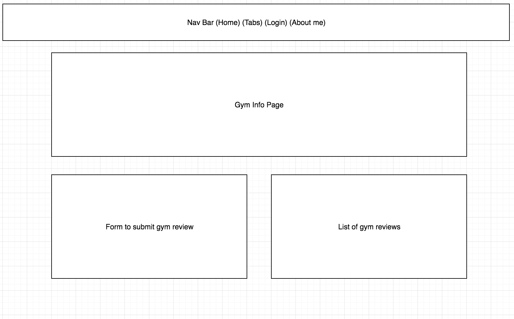

# Project 2 #

Users can search for gyms in any area and find other people that follow the same gym. The purpose of this app is to encourage people to network with other people that go to the same gym as them. Users can also write reviews for gyms, which are viewable on each gym's info page.

#### User Stories ####
* Katrina, a 36 year old inactive female, wants to find a gym near hear with good reviews
* Alfred, a 23 year old runner, just moved to Seattle and wants to find gym buddies near him

#### Planning ####

#### Tech Used ####
* HTML
* CSS
* JavaScript
* Node/Express
* Google Places API

#### Credits ####
* community.jpg retrieved from "https://communitysharesmke.org/wp-content/uploads/2015/12/community1.jpg"
* gym.jpg retrieved from "http://www.harrogatesfc.co.uk/wp-content/uploads/2015/11/12208762_995467120517853_7018141057947368028_n.jpg"

#### Next Steps ####